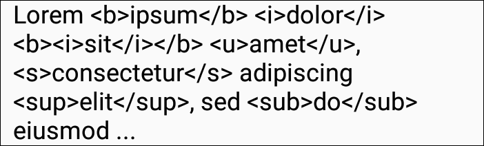

# htmdocument

Модуль `htmldocument` это развитие модуля [`document`] для перевода текста HTML в форматированный текст, предоставляемый классом `Document`.

[`document`]: https://github.com/vi-k/kotlin-utils/wiki/document
[`DocumentView`]: https://github.com/vi-k/android-documentview
[`SimpleHtmlDocument`]: #simplehtmldocument

## Содержание модуля

- [Простой пример](#Простой-пример)
- [Абзацы и заголовки](#Абзацы-и-заголовки)
- [Разделы и разрывы строк](#Разделы-и-разрывы-строк)
- [Атрибуты тегов](#Атрибуты-тегов)
- [`SimpleHtmlDocument`]

# Простой пример

Для отображения результатов используем виджет [`DocumentView`]. Для этого встроенный объект класса `Document` заменяем на `BaseHtmlDocument`:

```kotlin
class MainActivity : AppCompatActivity() {
    override fun onCreate(savedInstanceState: Bundle?) {
        super.onCreate(savedInstanceState)
        setContentView(R.layout.activity_main)

        val documentView: DocumentView = findViewById(R.id.docView)
    
        val htmlDocument = BaseHtmlDocument()
        documentView.document = htmlDocument
        
        htmlDocument.text = "Lorem <b>ipsum</b> <i>dolor</i> <b><i>sit</i></b> <u>amet</u>, " +
                "<s>consectetur</s> adipiscing <sup>elit</sup>, sed <sub>do</sub> eiusmod ..."
    }
}

```



Класс `BaseHtmlDocument` это основа для работы с HTML. Он парсит полученный текст, видит все теги, которые мы указали, но пока ещё ничего не знает о том, что с ними делать, поэтому мы и не видим ожидаемого результата. Исправляем:

```kotlin
htmlDocument {
    tag("b") {
        type = Tag.Type.CHARACTER
        characterStyle {
            bold = true
        }
    }

    htmlDocument.text = "Lorem <b>ipsum</b> <i>dolor</i> <b><i>sit</i></b> <u>amet</u>, " +
            "<s>consectetur</s> adipiscing <sup>elit</sup>, sed <sub>do</sub> eiusmod ..."
```


Это DSL внутри kotlin.

Здесь мы объявляем тег `b`, устанавливаем его тип (`CHARACTER`) и определяем стиль знаков. Текст устанавливаем строго после объявления всех тегов, т.к. он парсится в месте установки с уже имеющимися настройками. Настройки, объявленые позже, не влияют на результат предыдущего парсинга.

Добавляем следующий тег:

```kotlin
tag("i") {
    type = Tag.Type.CHARACTER
    characterStyle {
        italic = true
    }
}
```


Продолжаем:

```kotlin
tag("u") {
    type = Tag.Type.CHARACTER
    characterStyle {
        underline = true
    }
}

tag("s") {
    type = Tag.Type.CHARACTER
    characterStyle {
        strike = true
    }
}

tag("sup") {
    type = Tag.Type.CHARACTER
    characterStyle {
        verticalAlign = CharacterStyle.VAlign.TOP
        size = Size.em(0.58f)
    }
}

tag("sub") {
    type = Tag.Type.CHARACTER
    characterStyle {
        verticalAlign = CharacterStyle.VAlign.BASELINE_TO_BOTTOM
        size = Size.em(0.58f)
        leading = Size.ratio(1f)
    }
}
```


Примеры настройки `characterStyle` описаны в документации к [`DocumentView`].

Разумеется, таким образом можно объявить и свои собственные теги:

```kotlin
tag("red") {
    type = Tag.Type.CHARACTER
    characterStyle {
        color = Color.RED
    }
}

tag("condensed") {
    type = Tag.Type.CHARACTER
    characterStyle {
        scaleX = 0.6f
    }
}

htmlDocument.text = "<red>Lorem</red> <b>ipsum</b> <i>dolor</i> <b><i>sit</i></b> " +
        "<u>amet</u>, <s>consectetur</s> adipiscing <sup>elit</sup>, sed <sub>do</sub> " +
        "<condensed>eiusmod</condensed> ..."
```


`BaseHtmlDocument` существует специально для тонкой настройки под собственные нужды - не всегда программисту нужны все стандартные возможности HTML, зато может понадобиться нестандартный функционал. Особенно это важно, когда HTML-текст поставляется не самим программистом, который в состоянии сам себя контролировать, а пользователем, от которого можно получить совсем не то, что ожидалось. И с одной стороны, где-то надо ограничить пользователя в возможностях, а с другой, в чём-то облегчить ему жизнь, добавив какие-нибудь специфические возможности. Если же ручная настройка не нужна, то можно использовать класс [`SimpleHtmlDocument`], уже настроенный на базовое форматирование HTML.

# Абзацы и заголовки

Абзацы (paragraphs), в том числе и заголовки, устанавливаются через тип тега `PARAGRAPH`. Помимо стиля знаков `characterStyle` к ним применимы стили рамок `borderStyle` и абзацев `paragraphStyle`:

```kotlin
htmlDocument {
    tag("h1") {
        type = Tag.Type.PARAGRAPH
        characterStyle {
            size = Size.em(2f)
            bold = true
        }
        paragraphStyle {
            spaceBefore = Size.em(0.67f)
            spaceAfter = Size.em(0.67f)
        }
    }

    tag("h2") {
        type = Tag.Type.PARAGRAPH
        characterStyle {
            size = Size.em(1.5f)
            bold = true
        }
        paragraphStyle {
            spaceBefore = Size.em(0.83f)
            spaceAfter = Size.em(0.83f)
        }
    }

    tag("h3") {
        type = Tag.Type.PARAGRAPH
        characterStyle {
            size = Size.em(1.17f)
            bold = true
        }
        paragraphStyle {
            spaceBefore = Size.em(1f)
            spaceAfter = Size.em(1f)
        }
    }

    tag("p") {
        type = Tag.Type.PARAGRAPH
        paragraphStyle {
            spaceBefore = Size.em(1f)
            spaceAfter = Size.em(1f)
        }
    }

    text = """
        <h1>Lorem ipsum</h1>
        <p>Lorem ipsum dolor sit amet, consectetur adipiscing elit, sed do eiusmod tempor incididunt ut labore et dolore magna aliqua.</p>
        <h2>Ut enim</h2>
        <p>Ut enim ad minim veniam, quis nostrud exercitation ullamco laboris nisi ut aliquip ex ea commodo consequat.</p>
        <h3>Duis aute</h3>
        <p>Duis aute irure dolor in reprehenderit in voluptate velit esse cillum dolore eu fugiat nulla pariatur.</p>
        <p>Excepteur sint occaecat cupidatat non proident, sunt in culpa qui officia deserunt mollit anim id est laborum.</p>
    """.trimIndent()
}
```


В этом примере настройки были взяты из Chrome. Можно настроить и по-своему:

```kotlin
documentView.fontList {
    "sans_serif" family Font(Typeface.SANS_SERIF)
    "serif" family Font(Typeface.SERIF)
}

htmlDocument {
    characterStyle {
        size = Size.pt(8f)
        font = "sans_serif"
    }

    paragraphStyle {
        firstLeftIndent = Size.pt(16f)
        spaceBefore = Size.pt(4f)
        spaceAfter = Size.pt(4f)
    }

    tag("h1") {
        type = Tag.Type.PARAGRAPH
        characterStyle {
            size = Size.pt(16f)
            bold = true
            font = "serif"
        }
        paragraphStyle {
            spaceBefore = Size.pt(12f)
            spaceAfter = Size.pt(12f)
        }
    }

    tag("h2") {
        type = Tag.Type.PARAGRAPH
        characterStyle {
            size = Size.pt(12f)
            bold = true
            font = "serif"
        }
        paragraphStyle {
            spaceBefore = Size.pt(8f)
            spaceAfter = Size.pt(8f)
        }
    }

    tag("h3") {
        type = Tag.Type.PARAGRAPH
        characterStyle {
            bold = true
            font = "serif"
        }
    }

    tag("p") {
        type = Tag.Type.PARAGRAPH
    }
    ...
}
```


Здесь мы сначала настроили общие параметры для всего документа, и только затем в тегах добавили отличия.

# Разделы и разрывы строк

Разделы (sections) служат для объединения абзацев. Стили `characterStyle` и `paragraphStyle` влияют на все содержащиеся в них абзацы. Стиль `borderStyle` имеет отношение только к самой секции:

```kotlin
htmlDocument {
    tag("p") {
        type = Tag.Type.PARAGRAPH
    }

    tag("div") {
        type = Tag.Type.SECTION
        characterStyle {
            italic = true
            font = "serif"
        }
        paragraphStyle {
            spaceBefore = Size.em(0.5f)
            spaceAfter = Size.em(0.5f)
        }
        borderStyle {
            horizontalPadding = Size.em(1f)
            border = Border.dp(1f, Color.rgb(0x22A7F0))
            verticalMargin = Size.mm(2f)
        }
    }

    tag("div2") {
        type = Tag.Type.SECTION
        characterStyle {
            font = "sans_serif"
            color = Color.GRAY
        }
        paragraphStyle {
            firstLeftIndent = Size.em(2f)
            align = ParagraphStyle.Align.JUSTIFY
        }
        borderStyle {
            marginLeft = Size.dp(16f)
            borderLeft = Border.dp(8f, Color.LTGRAY)
            paddingLeft = Size.dp(16f)
            verticalMargin = Size.mm(2f)
        }
    }

    tag("br") {
        type = Tag.Type.BR
    }

    text = """
        <div>
            <p>Lorem<br> ipsum dolor<br> sit amet, consecte-<br>tur adipiscing elit, sed do<br> eiusmod tempor incididunt ut labore et dolore magna aliqua.</p>
            <p>Ut enim ad minim veniam, quis<br> nostrud exercitation ullamco<br> laboris nisi ut aliquip<br> ex ea commodo<br> consequat.</p>
        </div>
        <div2>
            <p>Duis aute irure dolor in reprehenderit in voluptate velit esse cillum dolore eu fugiat nulla pariatur.</p>
            <p>Excepteur sint occaecat cupidatat non proident, sunt in culpa qui officia deserunt mollit anim id est laborum.</p>
        </div2>
    """.trimIndent()
}
```


# Атрибуты тегов

При настройке тега блоки `characterStyle`, `paragraphStyle` и `borderStyle` не выполняются сразу для получения готового стиля. Они будут запущены позже (по аналогии с модификатором `lazy`), когда будет парситься соответствующий тег. Неявным параметром `this` в эти блоки (это обычные лямбды) передаётся сам стиль, а явным параметром (по-умолчанию `it`) передаётся тег, который хранит в себе весь список атрибутов, полученных из HTML. По этим атрибутам мы можем настроить наши теги:

```kotlin
htmlDocument {
    tag("font") {
        type = Tag.Type.CHARACTER
        characterStyle { tag ->
            tag.attributes["color"]?.toHtmlColor()?.also { color = it }
            tag.attributes["size"]?.toHtmlSize(allowPercent = true)?.also { size = it }
            tag.attributes["face"]?.also { font = it }
        }
    }

    tag("span") {
        type = Tag.Type.CHARACTER
    }


    htmlDocument.text = "<font color='#ff0000'>Lorem</font> " +
            "<font color='#0f0'>ipsum</font> " +
            "<font color='rgb(0,0,255)'>dolor</font> " +
            "<font color='rgba(0,0,0,0.5)'>sit</font> " +
            "<font size='1.75em'>amet</font>, " +
            "<font size='24px'>consectetur</font> " +
            "<font size='125%'>adipiscing</font> " +
            "elit, " +
            "<font face='mono'>sed do eiusmod</font> " +
            "<font face='georgia'>tempor incididunt ut labore</font> " +
            "<span color='#f00' size='2em' face='sans_serif'>et dolore magna aliqua</span>."
}
```


`BaseHtmlDocument` уже содержит готовые функции для преобразования атрибутов из строчного представления в программное (`toHtmlColor`, `toHtmlSize`, `splitBySpace`). Пример со `span` показывает, что атрибуты, определённые в теге `font` не влияют на другие теги.

Это такой возможный "хардкод". Но тот же результат можно получить, сделав описание атрибутов внутри тега:

```kotlin
htmlDocument {
    tag("font") {
        type = Tag.Type.CHARACTER
        attr("color") {
            characterStyle { value ->
                value.toHtmlColor()?.also { color = it }
            }
        }
        attr("size") {
            characterStyle { value ->
                value.toHtmlSize()?.also { this.size = it }
            }
        }
        attr("face") {
            characterStyle { value ->
                value.also { font = it }
            }
        }
    }
    ...
}
```

Результат в итоге будет тот же самый. Отличия лишь в том, что в первом случае будет проверяться каждый атрибут, который вообще возможен в теге `font`, а во втором случае - только атрибуты, объявленные в тексте. Такое объявление атрибутов касается только тега, в котором он объявлен, и на другой тег (в нашем примере это `span`) не влияет.

Блоки стилей `characterStyle`, `borderStyle` и `paragraphStyle` в описании `attr` это тоже лямбды с отложенным (`lazy`) запуском, существующие в двух вариантах:

- с одним параметром - значением атрибута;
- и с двумя параметрами - тегом и значением атрибута.

Указать и назвать параметры надо обязательно. Неявный вариант работать не будет:

```kotlin
// 1) Только значение атрибута
characterStyle { value ->
    ...
}
// 2) И тег, и значение атрибута
characterStyle { tag, value ->
    ...
}
// 3) Ошибка, не откомпилируется!
characterStyle {
    ...
}
```

Атрибут может быть объявлен и вне объявление тега, только вторым параметром в этом случае надо указать название тега, к которому будет применено объявление атрибута.

```kotlin
htmlDocument {
    tag("font") {
        ...
    }
    
    attr("color", "font") {
        characterStyle { value ->
            value.toHtmlColor()?.also { color = it }
        }
    }
    attr("size", "font") {
        characterStyle { value ->
            value.toHtmlSize()?.also { this.size = it }
        }
    }
    attr("face", "font") {
        characterStyle { value ->
            value.also { font = it }
        }
    }
    ...
}
```

Результат будет всё тот же. В этом варианте следом за названием атрибута можно указать через запятую список тегов, к которым это объявление атрибута будет применено. Если список отсутствует, то объявление будет распространено на все теги:

```kotlin
htmlDocument {
    tag("p") {
        type = Tag.Type.PARAGRAPH
    }

    tag("div") {
        type = Tag.Type.SECTION
    }

    tag("div2") {
        type = Tag.Type.SECTION
    }

    attr("align", "h1", "h2", "h3", "h4", "h5", "h6", "div", "p") {
        paragraphStyle { value ->
            when (value) {
                "left" -> align = ParagraphStyle.Align.LEFT
                "center" -> align = ParagraphStyle.Align.CENTER
                "right" -> align = ParagraphStyle.Align.RIGHT
                "justify" -> align = ParagraphStyle.Align.JUSTIFY
            }
        }
    }

    attr("lang") {
        characterStyle { value ->
            if (value == "csl") font = "ponomar"
        }
    }

    htmlDocument.text = """
        <div align='center'>
            <p>In the centre</p>
            <p lang='csl'>Посредѣ̀</p>
        </div>
        <div align='right'>
            <p>On the right</p>
            <p lang='csl'>Ѡ҆деснѹ́ю</p>
        </div>
        <div2 align='center'>
            <p>Not in the centre. On the left</p>
            <p lang='csl'>Не посредѣ̀, а҆  ѡ҆шѹ́юю</p>
        </div2>
    """.trimIndent()
}
```


Атрибут `align` может теперь использоваться в тегах `h1`, `h2`, `h3`, `h4`, `h5`, `h6`, `div` и `p` и, соответственно, не будет работать в теге `div2`. Атрибут `lang` сделан универсальным для всех тегов.

# SimpleHtmlDocument

Описание появится позже.
