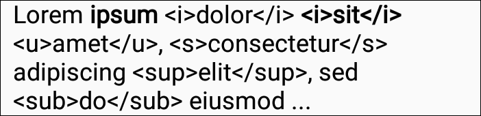
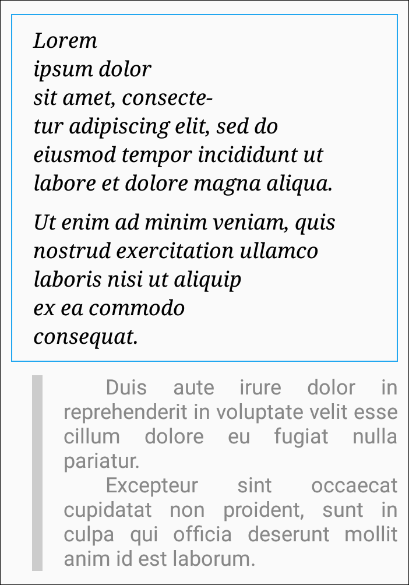

# htmdocument

Модуль `htmldocument` это развитие модуля [`document`] для перевода текста HTML в форматированный текст, предоставляемый классом `Document`.

[`document`]: https://github.com/vi-k/kotlin-utils/wiki/document
[`DocumentView`]: https://github.com/vi-k/android-documentview
[`SimpleHtmlDocument`]: #simplehtmldocument

## Содержание модуля

- [Простой пример](#Простой-пример)
- [Заголовки, секции и абзацы](#Заголовки-секции-и-абзацы)
- [Аттрибуты тегов](#Аттрибуты-тегов)
- [`SimpleHtmlDocument`]

# Простой пример

Для отображения результатов используем виджет [`DocumentView`]. Для этого встроенный объект класса `Document` заменяем на `BaseHtmlDocument`:

```kotlin
class MainActivity : AppCompatActivity() {
    override fun onCreate(savedInstanceState: Bundle?) {
        super.onCreate(savedInstanceState)
        setContentView(R.layout.activity_main)

        val documentView: DocumentView = findViewById(R.id.docView)
    
        val htmlDocument = BaseHtmlDocument()
        documentView.document = htmlDocument
        
        htmlDocument.text = "Lorem <b>ipsum</b> <i>dolor</i> <b><i>sit</i></b> <u>amet</u>, " +
                "<s>consectetur</s> adipiscing <sup>elit</sup>, sed <sub>do</sub> eiusmod ..."
    }
}

```


Класс `BaseHtmlDocument` это основа для работы с HTML. Он парсит полученный текст, видит все теги, которые мы указали, но пока ещё ничего не знает о том, что с ними делать, поэтому мы и не видим ожидаемого результата. Исправляем:

```kotlin
htmlDocument {
    tag("b") {
        type = Tag.Type.CHARACTER
        characterStyle {
            bold = true
        }
    }

    htmlDocument.text = "Lorem <b>ipsum</b> <i>dolor</i> <b><i>sit</i></b> <u>amet</u>, " +
            "<s>consectetur</s> adipiscing <sup>elit</sup>, sed <sub>do</sub> eiusmod ..."
```



Это DSL внутри kotlin.

Здесь мы объявляем тег `b`, устанавливаем его тип (`CHARACTER`) и определяем стиль знаков. Текст устанавливаем строго после объявления всех тегов, т.к. он парсится в месте установки с уже имеющимися настройками. Настройки, объявленые позже, не влияют на результат предыдущего парсинга.

Добавляем следующий тег:

```kotlin
tag("i") {
    type = Tag.Type.CHARACTER
    characterStyle {
        italic = true
    }
}
```


Продолжаем:

```kotlin
tag("u") {
    type = Tag.Type.CHARACTER
    characterStyle {
        underline = true
    }
}

tag("s") {
    type = Tag.Type.CHARACTER
    characterStyle {
        strike = true
    }
}

tag("sup") {
    type = Tag.Type.CHARACTER
    characterStyle {
        verticalAlign = CharacterStyle.VAlign.TOP
        size = Size.em(0.58f)
    }
}

tag("sub") {
    type = Tag.Type.CHARACTER
    characterStyle {
        verticalAlign = CharacterStyle.VAlign.BASELINE_TO_BOTTOM
        size = Size.em(0.58f)
        leading = Size.ratio(1f)
    }
}
```


Примеры настройки `characterStyle` описаны в документации к [`DocumentView`].

Разумеется, таким образом можно объявить и свои собственные теги:

```kotlin
tag("red") {
    type = Tag.Type.CHARACTER
    characterStyle {
        color = Color.RED
    }
}

tag("condensed") {
    type = Tag.Type.CHARACTER
    characterStyle {
        scaleX = 0.6f
    }
}

htmlDocument.text = "<red>Lorem</red> <b>ipsum</b> <i>dolor</i> <b><i>sit</i></b> " +
        "<u>amet</u>, <s>consectetur</s> adipiscing <sup>elit</sup>, sed <sub>do</sub> " +
        "<condensed>eiusmod</condensed> ..."
```


# Заголовки, секции и абзацы

```kotlin
htmlDocument {
    tag("h1") {
        type = Tag.Type.PARAGRAPH

        characterStyle {
            size = Size.em(2f)
            bold = true
        }

        paragraphStyle {
            spaceBefore = Size.em(0.67f)
            spaceAfter = Size.em(0.67f)
        }
    }

    tag("div") {
        type = Tag.Type.SECTION
    }

    tag("p") {
        type = Tag.Type.PARAGRAPH

        paragraphStyle {
            spaceBefore = Size.em(1f)
            spaceAfter = Size.em(1f)
        }
    }

    tag("br") {
        type = Tag.Type.BR
    }

    text = """
        <h1>Lorem ipsum</h1>
        <div>
            <p>Lorem ipsum dolor sit amet, consectetur adipiscing elit, sed do eiusmod tempor incididunt ut labore et dolore magna aliqua.</p>
            <p>Ut enim ad minim veniam, quis nostrud exercitation ullamco laboris nisi ut aliquip ex ea commodo consequat.</p>
            <p>Duis aute irure dolor in reprehenderit in voluptate velit esse cillum dolore eu fugiat nulla pariatur.</p>
            <p>Excepteur sint occaecat cupidatat non proident, sunt in culpa qui officia deserunt mollit anim id est laborum.</p>
        </div>
    """.trimIndent()
}
```


`BaseHtmlDocument` существует специально для тонкой настройки под собственные нужды - не всегда программисту нужны все стандартные возможности HTML, зато может понадобиться нестандартный функционал. Особенно это важно, когда HTML-текст поставляется не самим программистом, который в состоянии сам себя контролировать, а пользователем, от которого можно получить совсем не то, что ожидалось. И с одной стороны, где-то надо ограничить пользователя в возможностях, а с другой, в чём-то облегчить ему жизнь, добавив какие-нибудь специфические возможности.

Если ручная настройка не нужна, то можно использовать класс [`SimpleHtmlDocument`], уже готовый к использованию.

# Аттрибуты тегов

Как быть, если стиль тега должен быть настроен в зависимости от его аттрибутов? В DSL-разделах `characterStyle`, `paragraphStyle` и `borderStyle` устанавливается не стиль для тега, а лямбда-функция, которая будет запускаться каждый раз, когда соответствующий тег будет появляться. Первым неявным параметром (в виде `this`) в неё передаётся сам стиль, а вторым параметром (единственным явным) передаётся тег со списком аттрибутов. И уже исходя из установленных аттрибутов мы можем сделать необходимые настройки:

```kotlin
htmlDocument {
    tag("font") {
        type = Tag.Type.CHARACTER
        characterStyle { tag ->
            toHtmlColor(tag.attributes["color"])?.also { color = it }
            toHtmlSize(tag.attributes["size"], allowPercent = true)?.also { size = it }
        }
    }

    htmlDocument.text = "<font color='#ff0000'>Lorem</font> " +
            "<font color='#0f0'>ipsum</font> " +
            "<font color='rgb(0,0,255)'>dolor</font> " +
            "<font color='rgba(0,0,0,0.5)'>sit</font> " +
            "<font size='1.75em'>amet</font>, " +
            "<font size='24px'>consectetur</font> " +
            "<font size='125%'>adipiscing</font> elit..."
}
```



# SimpleHtmlDocument

Описание появится позже.
